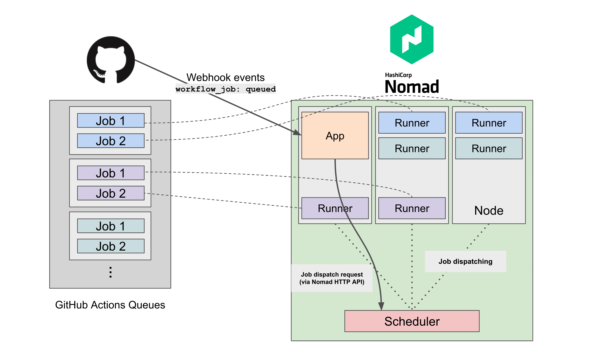

# nomad-github-runners-autoscaler

A demo-purpose Node.js application that listens to the GitHub Webhooks event (`workflow_job.queued`) and dispatches Nomad parameterized jobs using Nomad HTTP API to launch "on-demand" GitHub Actions Self-hosted Runners easily and efficiently.

This application implements the suggested autoscaling pattern mentioned in the GitHub documentation below:

- [Autoscaling with self-hosted runners](https://docs.github.com/en/actions/hosting-your-own-runners/autoscaling-with-self-hosted-runners)

### (optional) Horizontal Nomad Cluster Autoscaling

While this demo app shows you a conceptual way to auto-scale GitHub Actions Self-hosted runners on your Nomad Cluster, you may also want to ensure that there is always an appropriate amount of Nomad cluster resource to run your runners' workload at scale. This is achievable by using [Nomad Autoscaler](https://www.nomadproject.io/tools/autoscaling).

## Deploy to Docker

You may use a pre-built example `jrsyo/nomad-github-runners-autoscaler:alpha` image on the Docker Hub, or build your own using the `Dockerfile` in this repository.

- https://hub.docker.com/r/jrsyo/nomad-github-runners-autoscaler/tags

### Environment Variables

The following environment variables should be passed accordingly to run this app container.

- `PORT`: the port number
- `GH_WEBHOOK_SECRET`: your configured GitHub Webhook secret
- `NOMAD_HOST`: the Nomad host address (e.g., `http://example.com:4646`)
- `NOMAD_JOB_ID`: the Nomad Job ID to dispatch
- `NOMAD_TOKEN`: the Nomad token (requires permission to dispatch jobs)

```sh
docker run -d --restart always --name nomad-github-runners-autoscaler \
  -e PORT="8080" \
  -e GH_WEBHOOK_SECRET="mysecret" \
  -e NOMAD_HOST="http://127.0.0.1:4646" \
  -e NOMAD_JOB_ID="github_runner" \
  -e NOMAD_TOKEN="foo" \
  -e GH_WEBHOOK_SECRET="bar" \
  jrsyo/nomad-github-runners-autoscaler:alpha
```

## Deploy to Nomad cluster

### example architecture overview



**NOTE:** These examples assume that you have already set up Nomad Vault integration on your Nomad cluster to avoid hard-coding your GitHub personal access token to obtain the runner tokens on-demand. See [Vault integration](https://www.nomadproject.io/docs/integrations/vault-integration) for more details.

Or, you could remove the `vault` and `template` stanzas and pass secrets via the normal `env` stanza.

### example (webhook server)

This example job exposes the app container on port 8080 on the deployed Nomad node and lets the app container process incoming webhook requests directly. Therefore, you can't run multiple app containers (i.e., the `count` parameter).

This example is not meant to be a production-ready showcase. In a realistic environment, you should consider running load balancers in front of your apps. Please refer to HashiCorp's official learning guide resources such as [Load Balancer Deployment Considerations](https://learn.hashicorp.com/tutorials/nomad/load-balancing?in=nomad/load-balancing).

\* Since Nomad 1.3 will add a built-in service discovery feature, using the `template` stanza and accessing other services' address information does not necessarily require [Consul](https://www.nomadproject.io/docs/integrations/consul-integration) as before.

```hcl
job "gh_webhook_server" {
    datacenters = ["dc1"]
    type = "service"

    vault {
        policies = ["github-hashicorp-demo"]
        change_mode   = "noop"
    }

    group "server" {
        count = 1
        network {
            port "http" {
                static = 8080
            }
        }
        task "app" {
            driver = "docker"

            template {
                env = true
                destination = "secret/gh-webhook-server.env"
                data = <<EOF
                    NOMAD_TOKEN = "{{with secret "demos-secret/data/github-hashicorp-demo"}}{{index .Data.data "nomad-token"}}{{end}}"
                    GH_WEBHOOK_SECRET = "{{with secret "demos-secret/data/github-hashicorp-demo"}}{{index .Data.data "github-webhook-secret"}}{{end}}"
                EOF
            }

            env {
                PORT = "8080"
                NOMAD_HOST        = "http://${NOMAD_IP_http}:4646"
                NOMAD_JOB_ID      = "github_runner"
            }

            config {
                image = "jrsyo/nomad-github-runners-autoscaler:alpha"
                ports = [
                    "http",
                ]
            }
        }
    }
}
```

### example (GitHub Actions Runners)

See [myoung34/docker-github-actions-runner](https://github.com/myoung34/docker-github-actions-runner) for more details about configuration options.

```hcl
job "github_runner" {
    datacenters = ["dc1"]
    type = "batch"

    parameterized {
        payload = "forbidden"
        meta_required = ["GH_REPO_URL"]
    }

    vault {
        policies = ["github-hashicorp-demo"]
        change_mode   = "signal"
        change_signal = "SIGINT"
    }

    group "runners" {
        task "runner" {
            driver = "docker"

            template {
                env = true
                destination = "secret/vault.env"
                data = <<EOF
                    ACCESS_TOKEN = "{{with secret "demos-secret/data/github-hashicorp-demo"}}{{index .Data.data "github-pat"}}{{end}}"
                EOF
            }

            env {
                EPHEMERAL           = "true"
                DISABLE_AUTO_UPDATE = "true"
                RUNNER_NAME_PREFIX  = "gh-runner"
                RUNNER_WORKDIR      = "/tmp/runner/work"
                RUNNER_SCOPE        = "repo"
                REPO_URL            = "${NOMAD_META_GH_REPO_URL}"
                LABELS              = "linux-x86,t2-micro"
            }

            config {
                image = "myoung34/github-runner:latest"
                
                privileged  = true
                userns_mode = "host"

                volumes = [
                    "/var/run/docker.sock:/var/run/docker.sock",
                ]
            }
        }
    }
}
```
